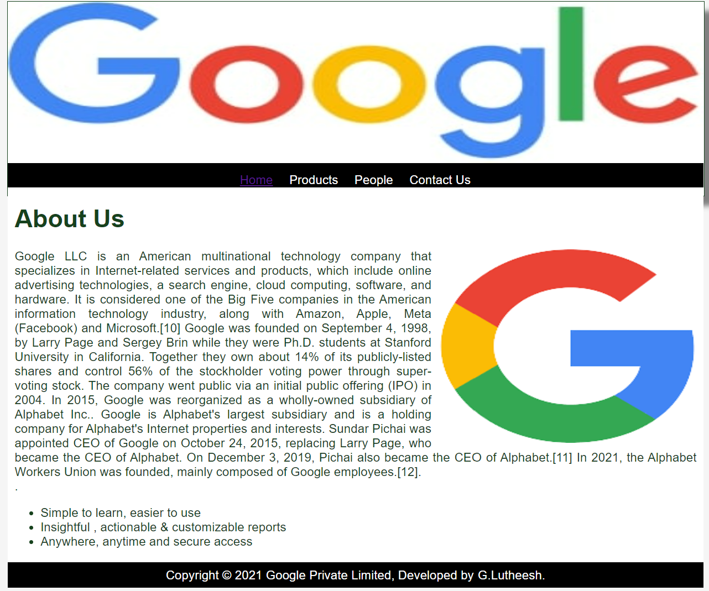
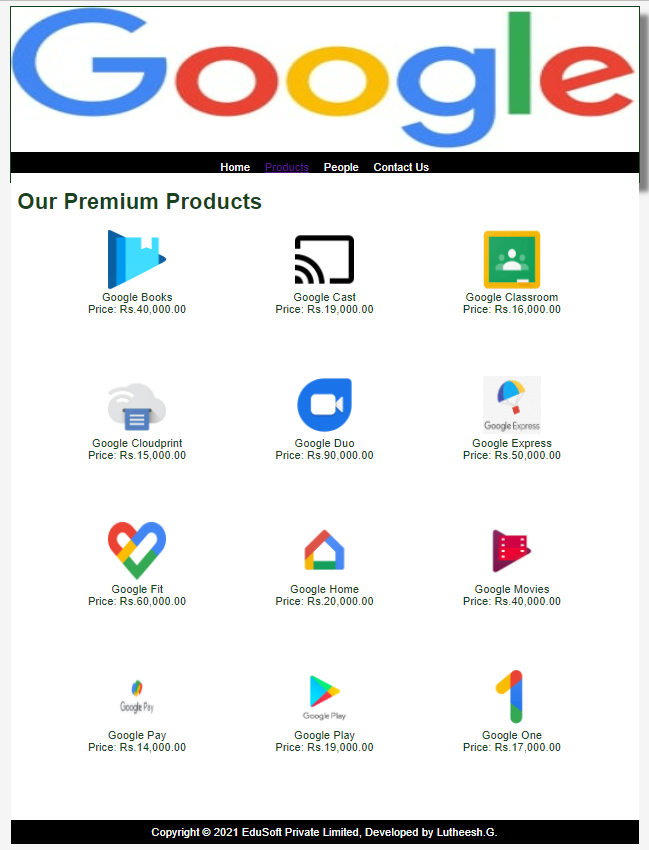
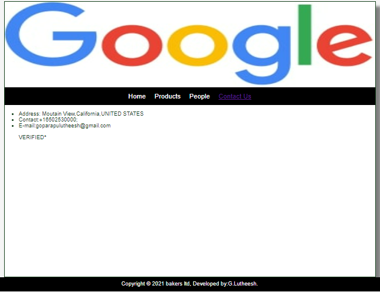

# Web Design for a Software Product Company

## AIM:

To design a static website for a software product company company.

## DESIGN STEPS:

### Step 1:

Requirement collection.

### Step 2:

Creating the layout using HTML and CSS.

### Step 3:

Updating the sample content.

### Step 4:

Choose the appropriate style and color scheme.

### Step 5:

Validate the layout in various browsers.

### Step 6:

Validate the HTML code.

### Step 6:

Publish the website in the given URL.

## PROGRAM :
layout.css
```
* {
  box-sizing: border-box;
  font-family: Arial, Helvetica, sans-serif;
}
body {
  background-color: whitesmoke;
  color: #17421d;
}
.container {
  width: 1080px;
  margin-left: auto;
  margin-right: auto;
  border-width: 1px 1px 1px 1px;
  border-style: solid;
  box-shadow: 15px 15px 8px gray;
}

.banner {
  display: block;
  width: 100%;
  height: 250px;
  text-align: center;
  font-size: 60px;
  background-image: url("/static/img/banner5.jpg");
  background-size: 100% 100%;
  margin: 0px 0px 0px 0px;
  padding-top: 150px;
  color: #b5c5c2;
}

.menu {
  display: block;
  width: 100%;
  height: 50px;
  font-size: larger;
  background-color: black;
  text-align: center;
  padding-top: 15px;
  margin: 0px 0px 0px 0px;
  border-width: 1px;
}

.menuitem {
  display: inline-block;
  margin-left: 10px;
  margin-right: 10px;
}
.menuitemselected {
  display: inline-block;
  margin-left: 10px;
  margin-right: 10px;
  color: #16d1ae;
}

.menuitem a {
  text-decoration: none;
  color: white;
}

.content {
  display: block;
  width: 100%;
  background-color: white;
  min-height: 500px;
  margin: 0px 0px 0px 0px;
  border-width: 1px;
  border-color: white;
  border-style: solid;
}
.homecontent {
  min-height: 500px;
  margin: 10px 10px 10px 10px;
}
.homecontent h1 {
  text-align: left;
}
.homecontent img {
  float: right;
  width: 400px;
  height: 300px;
  margin-left: 10px;
}

.contenttext {
  text-align: justify;
}

.productcontent {
  min-height: 500px;
  margin: 10px 10px 10px 10px;
}

.productcontent h1 {
  text-align: left;
}

.productitems {
  display: block;
}

.productitem {
  display: inline-block;
  width: 30%;
  height: 250px;
  text-align: center;
}

.productitem img {
  width: 100px;
  height: 100px;
  display: block;
}
.productitem .itemimage {
  display: block;
  margin-left: auto;
  margin-right: auto;
  width: 100px;
  margin-bottom: 5px;
}

.productitem .itemname {
  display: block;
}
.productitem .itemprice {
  display: block;
}

.footer {
  display: block;
  width: 100%;
  height: 40px;
  background-color: black;
  text-align: center;
  padding-top: 10px;
  margin: 0px 0px 0px 0px;
  color: white;
}
```
home page
```
<!DOCTYPE html>
<html lang="en">
  <head>
    <title>Google company </title>
    <link rel="stylesheet" href="./css/layout.css" />
    <link rel="icon" href="./img/logo1.png" type="image/x-icon" />
  </head>

  <body>
    <div class="container">
      <div class="banner"></div>
      <div class="menu">
        <div class="menuitemselected"><a href="/static/home.html">Home</a></div>
        <div class="menuitem"><a href="/static/products.html">Products</a></div>
        <div class="menuitem"><a href="/static/people.html">People</a></div>
        <div class="menuitem"><a href="/static/contactus.html">Contact Us</a></div>
      <div class="content">
        <div class="homecontent">
          <h1>About Us</h1>
          
          <div class="contenttext">
            Google LLC is an American multinational technology company that specializes in Internet-related services and products, which include online advertising technologies, a search engine, cloud computing, software, and hardware. It is considered one of the Big Five companies in the American information technology industry, along with Amazon, Apple, Meta (Facebook) and Microsoft.[10]

            Google was founded on September 4, 1998, by Larry Page and Sergey Brin while they were Ph.D. students at Stanford University in California. Together they own about 14% of its publicly-listed shares and control 56% of the stockholder voting power through super-voting stock. The company went public via an initial public offering (IPO) in 2004. In 2015, Google was reorganized as a wholly-owned subsidiary of Alphabet Inc.. Google is Alphabet's largest subsidiary and is a holding company for Alphabet's Internet properties and interests. Sundar Pichai was appointed CEO of Google on October 24, 2015, replacing Larry Page, who became the CEO of Alphabet. On December 3, 2019, Pichai also became the CEO of Alphabet.[11]
            
            In 2021, the Alphabet Workers Union was founded, mainly composed of Google employees.[12].
            <br />
           .
            <ul>
              <li>Simple to learn, easier to use</li>
              <li>Insightful , actionable & customizable reports</li>
              <li>Anywhere, anytime and secure access</li>
            </ul>
          </div>
        </div>
      </div>
      <div class="footer">
        Copyright &#169; 2021 Google Private Limited, Developed by G.Lutheesh.
      </div>
    </div>
  </body>
</html>
```
product page
```
<!DOCTYPE html>
<html lang="en">
  <head>
    <title>Google company</title>
    <link rel="stylesheet" href="./css/layout.css" />
    <link rel="icon" href="./img/logo1.png" type="image/x-icon" />
  </head>

  <body>
    <div class="container">
      <div class="banner"></div>
      <div class="menu">
        <div class="menuitem"><a href="/static/home.html">Home</a></div>
        <div class="menuitemselected"><a href="/static/products.html">Products</a></div>
        <div class="menuitem"><a href="/static/people.html">People</a></div>
        <div class="menuitem"><a href="/static/contactus.html">Contact Us</a></div>
      <div class="content">
        <div class="productcontent">    
          <h1>Our Premium Products</h1>
          <div class="productitems">
              <div class="productitem"> 
                  <div class="itemimage">
                  
                  </div>
                  <div class="itemname">Google Books</div>
                  <div class="itemprice">Price: Rs.40,000.00 </div>
              </div>
              <div class="productitem"> 
                  <div class="itemimage">
                  
                  </div>
                  <div class="itemname">Google Cast</div>
                  <div class="itemprice">Price: Rs.19,000.00 </div>
              </div>
              <div class="productitem"> 
                <div class="itemimage">
                
                </div>
                <div class="itemname">Google Classroom</div>
                <div class="itemprice">Price: Rs.16,000.00 </div>
            </div>
            <div class="productitem"> 
              <div class="itemimage">
              
              </div>
              <div class="itemname">Google Cloudprint</div>
              <div class="itemprice">Price: Rs.15,000.00 </div>
          </div>
          <div class="productitem"> 
            <div class="itemimage">
            
            </div>
            <div class="itemname">Google Duo</div>
            <div class="itemprice">Price: Rs.90,000.00 </div>
        </div>
        <div class="productitem"> 
          <div class="itemimage">
          
          </div>
          <div class="itemname">Google Express</div>
          <div class="itemprice">Price: Rs.50,000.00 </div>
      </div>
      <div class="productitem"> 
        <div class="itemimage">
        
        </div>
        <div class="itemname">Google Fit</div>
        <div class="itemprice">Price: Rs.60,000.00 </div>
    </div>
    <div class="productitem"> 
      <div class="itemimage">
      
      </div>
      <div class="itemname">Google Home</div>
      <div class="itemprice">Price: Rs.20,000.00 </div>
  </div>
  <div class="productitem"> 
    <div class="itemimage">
    
    </div>
    <div class="itemname">Google Movies</div>
    <div class="itemprice">Price: Rs.40,000.00 </div>
  </div>
  <div class="productitem"> 
    <div class="itemimage">
    
    </div>
    <div class="itemname">Google Pay</div>
    <div class="itemprice">Price: Rs.14,000.00 </div>
  </div>
  <div class="productitem"> 
    <div class="itemimage">
    
    </div>
    <div class="itemname">Google Play</div>
    <div class="itemprice">Price: Rs.19,000.00 </div>
  </div>
  <div class="productitem"> 
    <div class="itemimage">
    
    </div>
    <div class="itemname">Google One</div>
    <div class="itemprice">Price: Rs.17,000.00 </div>
  </div>
  
          </div>
          </div>        
      </div>
      <div class="footer">
        Copyright &#169; 2021 EduSoft Private Limited, Developed by Lutheesh.G.
      </div>
    </div>
  </body>
</html>
```
people page
```
<!DOCTYPE html>
<html lang="en">
  <head>
    <title>Google company</title>
    <link rel="stylesheet" href="./css/layout.css" />
    <link rel="icon" href="./img/logo1.png" type="image/x-icon" />
  </head>

  <body>
    <div class="container">
      <div class="banner"></div>
      <div class="menu">
        <div class="menuitem"><a href="/static/home.html">Home</a></div>
        <div class="menuitem"><a href="/static/products.html">Products</a></div>
        <div class="menuitemselected"><a href="/static/people.html">People</a></div>
        <div class="menuitem"><a href="/static/contactus.html">Contact Us</a></div>
      <div class="content">
        <div class="productcontent">    
            <h1>BEST EMPLOYEEE IN GOOGLE</h1>
            <div class="productitems">
                <div class="productitem"> 
                    <div class="itemimage">
                    
                    </div>
                    <div class="itemname">Sundar Pichai</div>
                    <div class="itemprice">Ceo OF Google</div>
                </div>
                <div class="productitem"> 
                    <div class="itemimage">
                    
                    </div>
                    <div class="itemname">Eileen Naughtomn</div>
                    <div class="itemprice">HR of Google</div>
                </div>
                <div class="productitem"> 
                    <div class="itemimage">
                    
                    </div>
                    <div class="itemname">Rajan Anandh</div>
                    <div class="itemprice">India Google Managing Director</div>
                </div>
                <div class="productitem"> 
                    <div class="itemimage">
                    
                    </div>
                    <div class="itemname">Anal Ghosh</div>
                    <div class="itemprice">Senior Program Manager</div>
                </div>
                <div class="productitem"> 
                    <div class="itemimage">
                    
                    </div>
                    <div class="itemname">Johanna Wright</div>
                    <div class="itemprice">Director of Product Manager</div>
                </div>
                <div class="productitem"> 
                    <div class="itemimage">
                    
                    </div>
                    <div class="itemname">Sanjay Gupta</div>
                    <div class="itemprice">Business Executive</div>
                </div>

          </div>
        </div>
      </div>
      <div class="footer">
        Copyright &#169; 2021 google ltd, Developed by:G.Lutheesh
      </div>
    </div>
  </body>
</html>
```
contactUs page
```
<!DOCTYPE html>
<html lang="en">
  <head>
    <title>Google company</title>
    <link rel="stylesheet" href="./css/layout.css" />
    <link rel="icon" href="./img/logo1.png" type="image/x-icon" />
  </head>

  <body>
    <div class="container">
      <div class="banner"></div>
      <div class="menu">
        <div class="menuitem"><a href="/static/home.html">Home</a></div>
        <div class="menuitem"><a href="/static/products.html">Products</a></div>
        <div class="menuitem"><a href="/static/people.html">People</a></div>
        <div class="menuitemselected"><a href="/static/contactus.html">Contact Us</a></div>
      </div>
      <div class="content">
          <ul>
              <li>Address: Moutain View,California,UNITED STATES <br></li>
              <li>Contact:+16502530000;<br></li>
              <li>E-mail:goparapulutheesh@gmail.com<br></li>
              <br>VERIFIED*
          </ul>
      </div>
    </div>
    </div>
      <div class="footer">
        Copyright &#169; 2021 bakers ltd, Developed by:G.Lutheesh.
      </div>
    </div>
  </body>
</html>
```

## OUTPUT:

### Home Page:


### PRODUCTS:

### PEOPLE:

### CONTACTUS:


## Result:

Thus a website is designed for the software product company and the HTML,CSS code are validated.
